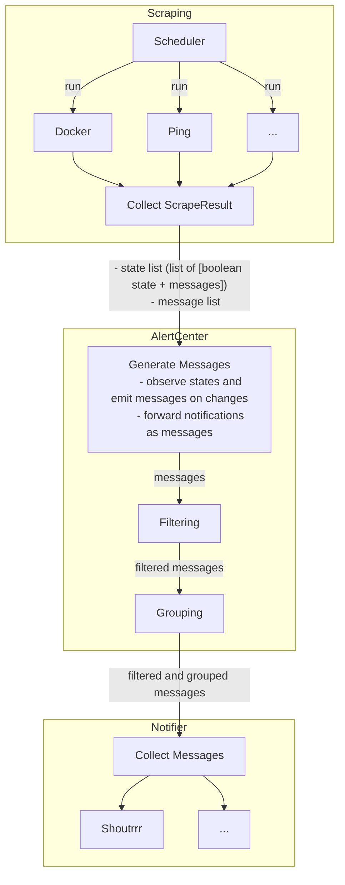

# minimal-server-monitoring
[](https://opensource.org/licenses/MIT)
[](https://github.com/mcarbonne/minimal-server-monitoring/tags)
[](https://github.com/mcarbonne/minimal-server-monitoring)

This tool lets you monitor a typical home server running applications in containers and receive alerts on your smartphone. It is designed to be light and simple (no database, no GUI, a single configuration file).


## Features
- run in a container (tested with both docker and podman)
- send notifications to any supported services by [shoutrrr](https://containrrr.dev/shoutrrr/v0.8/services/overview/)
- alert when a container is restarting forever
- alert when a container isn't started
- alert when a target is unreachable (ping)
- notify when a container image is updated (provide an alternative to [watchtower](https://containrrr.dev/watchtower/) if you are running podman with podman-auto-update)

## Minimal configuration
### Bare minimum (container monitoring only, and alerts with shoutrrr)
```
docker run -e MACHINENAME=$(hostname) -e SHOUTRRR=XXXXXXX -v .../cache.json:/app/cache.json -v /var/run/docker.sock:/var/run/docker.sock:ro \
--name minimal-server-monitoring -d ghcr.io/mcarbonne/minimal-server-monitoring:latest
```

### Custom config.json
```
docker run -v .../config.json:/app/config.json:ro -v .../cache.json:/app/cache.json -v /var/run/docker.sock:/var/run/docker.sock:ro \
--name minimal-server-monitoring -d ghcr.io/mcarbonne/minimal-server-monitoring:latest
```

- `-v .../config.json:/app/config.json:ro`: override default configuration file with your settings. Default configuration file is available [here](docker_config.json). Have a look at [example_config.json](example_config.json) for an exhaustive lists of available parameters.
- `-v .../cache.json:/app/cache.json`: persist the cache
- `-v /var/run/docker.sock:/var/run/docker.sock:ro`: give access to the host docker daemon (and allow monitoring of running containers). Use `/run/podman/podman.sock:/var/run/docker.sock:ro` if you are using podman.

## Internal


### Scraping
Schedule configured scrapers.
Each scraper may emit multiple states and multiple messages.
On contrary to some other monitoring tools, decisions are taken in scrapers (i.e. is metric healthy).

Multiple instances of a given provider may be allowed (depending on provider).

A **State** metric is the combination of a metricId, a state (boolean) and a message.
Example: `metricId: "docker_container_XXXX_state", isHealthy: false, message: "XXXX isn't running"`

A **Message** metric is the combination of a metricId and a message.
Example: `metricId: "docker_container_XXXX_updated", message: "container XXXX was updated ...."`

Currently, the following scraper providers are implemented :

#### docker
- no parameters
- only one instance allowed
- messages (for every running containers):
  - when a container image is updated
- states (for every running containers):
  - container status (check if started)
  - container restart (check if restarting forever)

#### ping
|parameter|description|required|default value|
|-----|-----------|--------|-------------|
|targets|lst of ip address (or hostname) to ping|yes|-|
|retry_count|how many times to retry if ping failed|no|3|

- provide one state: is target reachable.
- multiple instances allowed

#### filesystemusage
|parameter|description|required|default value|
|-----|-----------|--------|-------------|
|mountpoints|list of mount points to check|yes|-|
|threshold_percent|minimum threshold (percentage) of remaining disk space|no|20|

- provide one state per mountpoint
- multiple instances allowed

### AlertCenter
AlertCenter is here to:
- avoid false positives (basic state machine when generating messages)
- avoid beeing flooded with notifications (filtering + grouping)

#### Generate messages
If a state is marked as failed `unhealthy_threshold` time in a row, a message is sent (metric XX failed).
If a state is marked as OK `healthy_threshold` time in a row, a message is sent (metric XX OK).

Notifications are forwared as messages (no processing at this step).

#### Filtering
Avoid sending too many messages for a given `metricId`.
Each `metricId` is allowed to send at most 5 messages every 30 minutes.

#### Grouping
When processing a message, wait up to 15 seconds to group at most 10 messages.

### Notifier
Send all messages to all configured notifiers.
Multiple instances of each type allowed.