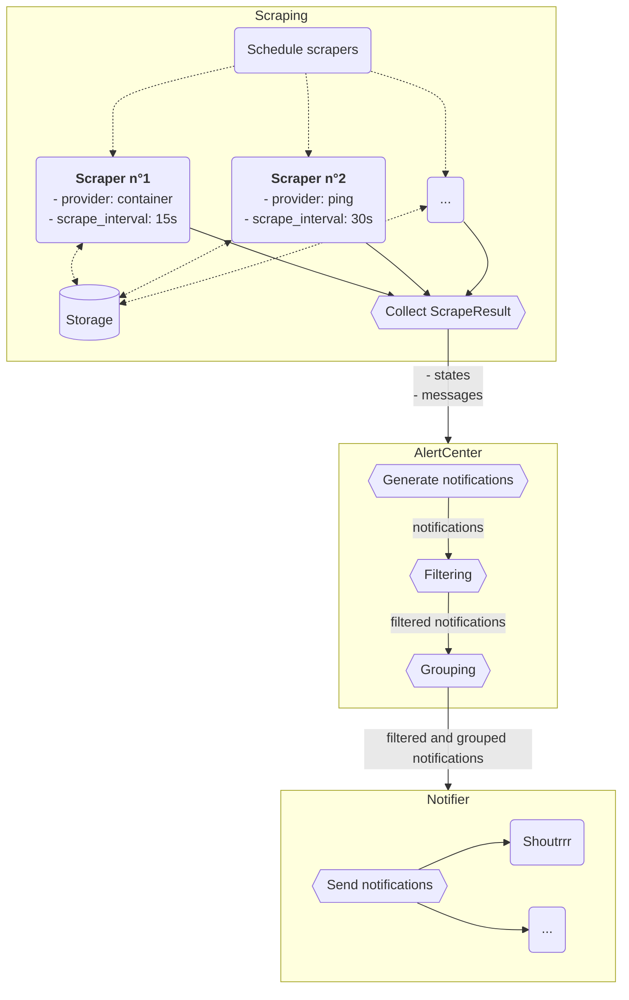

# minimal-server-monitoring
[](https://opensource.org/licenses/MIT)
[](https://github.com/mcarbonne/minimal-server-monitoring/tags)
[](https://github.com/mcarbonne/minimal-server-monitoring)
[](https://goreportcard.com/report/github.com/mcarbonne/minimal-server-monitoring)

This tool lets you monitor a typical home server running applications in containers and receive alerts on your smartphone. It is designed to be light and simple (no database, no GUI, a single configuration file).


## Features
- run in a container (tested with both docker and podman)
- send notifications to any supported services by [shoutrrr](https://containrrr.dev/shoutrrr/v0.8/services/overview/)
- alert when a container is restarting forever
- alert when a container isn't started
- alert when a target is unreachable (ping)
- alert when available disk space is low
- alert when systemd service is failed
- notify when a container image is updated (provide an alternative to [watchtower](https://containrrr.dev/watchtower/) if you are running podman with podman-auto-update)

## Versioning and packaging
This tool follows [semantic versioning](https://semver.org/).

Pre-built images are available on github packages:
- `ghcr.io/mcarbonne/minimal-server-monitoring:main` (`main` branch)
- `ghcr.io/mcarbonne/minimal-server-monitoring:latest`: latest tagged version
- `ghcr.io/mcarbonne/minimal-server-monitoring:x.x.x`
- `ghcr.io/mcarbonne/minimal-server-monitoring:x.x`
- `ghcr.io/mcarbonne/minimal-server-monitoring:x`

For automatic updates ([watchtower](https://github.com/containrrr/watchtower), [podman-auto-update](https://docs.podman.io/en/latest/markdown/podman-auto-update.1.html)...), using the lastest major tag available (`ghcr.io/mcarbonne/minimal-server-monitoring:2`) is recommanded to avoid breaking changes.

## Changelog

See [here](CHANGELOG.md).


## Minimal configuration
### Default config.yml: container, services and available disk space monitoring, with shoutrrr alerts
```
docker run -e MACHINENAME=$(hostname) -e SHOUTRRR=XXXXXXX \
-v .../cache.json:/app/cache.json \
-v /var/run/docker.sock:/var/run/docker.sock:ro \
-v /run/systemd:/run/systemd:ro \
-v /:/host:ro \
--name minimal-server-monitoring -d ghcr.io/mcarbonne/minimal-server-monitoring:2
```

### Custom config.yml
```
docker run \
-v .../config.yml:/app/config.yml:ro \
-v .../cache.json:/app/cache.json \
-v /var/run/docker.sock:/var/run/docker.sock:ro \
-v /run/systemd:/run/systemd:ro \
-v /:/host:ro \
--name minimal-server-monitoring -d ghcr.io/mcarbonne/minimal-server-monitoring:2
```

- `-v .../config.yml:/app/config.yml:ro`: override default configuration file with your settings. Default configuration file is available [here](docker_config.yml). Have a look at [example_config.yml](example_config.yml) for an exhaustive lists of available parameters.
- `-v .../cache.json:/app/cache.json`: persist the cache
- `-v /var/run/docker.sock:/var/run/docker.sock:ro`: give access to the host docker daemon (required for container provider). Use `/run/podman/podman.sock:/var/run/docker.sock:ro` if you are using podman.
- `-v /run/systemd:/run/systemd:ro`: give access to the host systemd (required for systemd provider)
- `-v /:/host:ro`: required for `filesystemusage` to discover and monitor all mountpoints. **Target in container must match `mountprefix` parameter** (see [here](#filesystemusage)).

## config.yml
|key|type|required|default value|
|-----|-----------|--------|-------------|
|notifiers|map of [notifiers](#notifier-configuration)|yes|-|
|cache|string (path)|yes|-|
|alert.unhealthy_threshold|uint|no|1|
|alert.healthy_threshold|uint|no|1|
|alert.failure_reminder|duration <sup>[*](#type-parsing)</sup>|no|2h|
|alert.grouping.window|duration <sup>[*](#type-parsing)</sup>|no|15s|
|scrapers|map of [scrapers](#scrapper-configuration)|yes|-|

### Type Parsing
#### Duration
String with unit. See [here](https://pkg.go.dev/time#ParseDuration) for details.


### notifier configuration
|key|type|required|default value|
|-----|-----------|--------|-------------|
|type|enum ([shoutrrr](#shoutrrr), [console](#console))|yes|-|
|params|map, see below for details|no|{}|

#### shoutrrr
|key|description|required|default value|
|-----|-----------|--------|-------------|
|url|shoutrrr url|yes|-|

#### console
- no parameters
- all notifications are logged on the standard output

### scrapper configuration
|key|type|required|default value|
|-----|-----------|--------|-------------|
|type|enum ([systemd](#systemd), [container](#container), [filesystemusage](#filesystemusage), [ping](#ping))|yes|-|
|scrape_interval|duration <sup>[*](#type-parsing)</sup>|no|120s|
|params|map, see below|no|{}|

#### systemd
- no parameters
- only one instance allowed
- states (for every services):
  - service active state (`ActiveState != failed`)

#### container
- no parameters
- only one instance allowed
- messages (for every running containers):
  - when a container image is updated
- states (for every running containers):
  - container status (check if started)
  - container restart (check if restarting forever)
#### filesystemusage
- provide two states for each mountpoint (check if there is enough free disk space available and if there are rapid changes)
- multiple instances allowed

|parameter|description|required|default value|
|-----|-----------|--------|-------------|
|mountprefix|mountpoint prefix, when running inside a container|no|"" (empty string)|
|fstypes|list of file system types to consider|no|[ext4, btrfs]|
|mountpoint_blacklist|list of mountpoints to ignore|no|[]|
|mountpoint_whitelist|list of mountpoints to monitor. **When set, `fstypes` and `mountpoint_blacklist` are ignored and autodiscovery is skipped**|no|[]|
|threshold|minimum threshold of available disk space<sup>1</sup>|no|20%|
|rate_threshold|rate threshold over rate_threshold_window period<sup>1,2</sup>|no|1g|
|rate_threshold_window|window duration<sup>2</sup>|no|5m[*](#type-parsing)|

1. thresholds might either be relative (20%) or absolute (50m, 20gb ...). Absolute parsing is done using `ParseBytes` from [go-humanize](https://github.com/dustin/go-humanize), supported prefix list is available [here](https://github.com/dustin/go-humanize/blob/master/bytes.go).
2. rate threshold triggers an alert when remaining disk space changes by more than `rate_threshold` over `rate_threshold_window` (both increase and decrease).
Note: `rate_threshold_window` must be greater than or equal to `scrape_interval`.

#### ping
- provide one state per target (is target reachable)
- multiple instances allowed

|parameter|description|required|default value|
|-----|-----------|--------|-------------|
|targets|list of ip addresses/hostnames to ping|yes|-|
|retry_count|how many times to retry if ping failed|no|3|

### Example:
```yaml
notifiers:
  notifier_1:
    type: console
  notifier_2:
    type: shoutrrr
    params:
      url: YOUR_SHOUTRRR_URL_HERE
cache: /tmp/cache.json
alert:
  unhealthy_threshold: 1
  healthy_threshold: 1
scrapers:
  docker:
    type: container
  systemd:
    type: systemd
  gateway:
    type: ping
    scrape_interval: 5s
    params:
      targets:
        - 192.168.0.1
  ethernet_available:
    type: ping
    scrape_interval: 2m
    params:
      targets:
        - 8.8.8.8
      retry_count: 3
  filesystemusage:
    type: filesystemusage
    params:
      mountpoints:
        - "/"
      threshold: 15%

```

## Internal


### Scraping
Schedule configured scrapers.
Each scraper may emit multiple states and multiple messages.
On contrary to some other monitoring tools, decisions are taken in scrapers (i.e. are metric healthy).

Multiple instances of a given provider may be allowed (depending on provider).

A **State** metric is the combination of a metricId, a state (boolean) and a message.
Example: `metricId: "container_XXXX_state", isHealthy: false, message: "XXXX isn't running"`

A **Message** metric is the combination of a metricId and a message.
Example: `metricId: "container_XXXX_updated", message: "container XXXX was updated ...."`

Providers can persist data using **Storage**, a simple key-value database.

### AlertCenter
AlertCenter is here to:
- emit notifications from scrape result
- avoid beeing flooded with notifications (filtering + grouping)

#### Generate notifications
If a state is marked as failed `unhealthy_threshold` time in a row, a notification is sent (metric XX failed).
If a state is marked as OK `healthy_threshold` time in a row, a notification is sent (metric XX OK).

Messages are forwared as notifications (no processing at this step).

#### Filtering
Avoid sending too many notifications for a given `metricId`.
Each `metricId` is allowed to send at most 5 messages every 30 minutes.

#### Grouping
When processing a notification, wait up to 15 seconds to group at most 10 notifications.

### Notifier
Send all notifications to all configured notifiers.
Multiple instances of each type are allowed.
